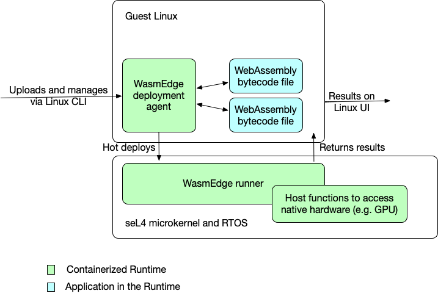

# 2.2.8 Build on seL4 RTOS

[Video demo](https://youtu.be/2Qu-Trtkspk) | [Build logs](https://github.com/second-state/wasmedge-seL4/runs/3982081148?check_suite_focus=true) | [Build artifact](https://github.com/second-state/wasmedge-seL4/actions/runs/1374510169)

In this article, we demonstrate how to run WasmEdge on the seL4 RTOS, there are two parts:

1. Guest Linux OS on seL4: This is the controller of WasmEdge runtime, which will send wasm program to WasmEdge runner that is a agent on seL4 to execute.
2. WasmEdge runner on seL4: This is the wasm program runtime, which will execute the given wasm program from Guest Linux OS.

The figure below illustrates the architecture of the system.



This demo is based on the seL4 simulator on Linux.

## Getting Started

### System requirements

Hardware:

- at least 4GB of RAM
- at least 20GB of disk storage (the wasmedge_sel4 directory will contain over 11 GB of data after the following installation completes)

Software: Ubuntu 20.04 with dev tools packages (ep. Python) installed. We recommend the [GitHub Actions Ubuntu 20.04 VM](https://github.com/actions/virtual-environments/blob/main/images/linux/Ubuntu2004-README.md) (See a list of [installed apt packages](https://github.com/actions/virtual-environments/blob/main/images/linux/Ubuntu2004-README.md#installed-apt-packages)). Or, you could use our Docker image (see the [Dockerfile](https://github.com/second-state/wasmedge-seL4/blob/main/docs/Dockerfile.sel4_build)).

```bash
$ docker pull wasmedge/sel4_build
$ docker run --rm -v $(pwd):/app -it wasmedge/sel4_build
(docker) root#
```

> If you do not want to build the seL4 system simulator yourself, you can download the [build artifact](https://github.com/second-state/wasmedge-seL4/actions/runs/1374510169) from our GitHub Actions, and skip directly to [Boot wasmedge-seL4](#boot-wasmedge-sel4)

### Automatic installation: all-in-one script

Use our all-in-one build script:

```bash
wget -qO- https://raw.githubusercontent.com/second-state/wasmedge-seL4/main/build.sh | bash
```

And this will clone and build our wasmedge on seL4 to an image.

After finishing the build script, you will have a folder `sel4_wasmedge`.

If this automatic installation completed successfully, skip over the manual installation information and proceed to [boot wasmedge-sel4](https://github.com/second-state/wasmedge-seL4#boot-wasmedge-sel4)

### Manual installation: managing memory usage

The above all-in-one script will work in most cases. However, if your system resources were stressed and you encountered an error such as `ninja: build stopped: subcommand failed` please note that you can decrease the parallelization of the install by explicitly passing in a `-j` parameter to the `ninja` command (on the last line of the `build.sh` file). You see, Ninja runs the most amount of parallel processes by default and so the following procedure is a way to explicitly set/reduce parallelization.

Manually fetch the `wasmedge-sel4 repository.

```bash
cd ~
git clone https://github.com/second-state/wasmedge-seL4.git
cd wasmedge-seL4
```

Manually edit the `build.sh` file.

```bash
vi build.sh
```

Add the following `-j` parameter to the last line of the file i.e.

```bash
ninja -j 2
```

Make the `build.sh` file executable.

```bash
sudo chmod a+x build.sh
```

Run the edited `build.sh file.

```bash
./build.sh
```

Once this manual installation is complete, follow along with the following steps; boot wasmedge-sel4

### Boot wasmedge-seL4

```bash
cd sel4_wasmedge/build
./simulate
```

Expected output:

```bash
$ ./simulate: qemu-system-aarch64 -machine virt,virtualization=on,highmem=off,secure=off -cpu cortex-a53 -nographic  -m size=2048  -kernel images/capdl-loader-image-arm-qemu-arm-virt
ELF-loader started on CPU: ARM Ltd. Cortex-A53 r0p4
  paddr=[6abd8000..750cf0af]
No DTB passed in from boot loader.
Looking for DTB in CPIO archive...found at 6ad18f58.
Loaded DTB from 6ad18f58.
   paddr=[60243000..60244fff]
ELF-loading image 'kernel' to 60000000
  paddr=[60000000..60242fff]
  vaddr=[ff8060000000..ff8060242fff]
  virt_entry=ff8060000000
ELF-loading image 'capdl-loader' to 60245000
  paddr=[60245000..6a7ddfff]
  vaddr=[400000..a998fff]
  virt_entry=408f38
Enabling hypervisor MMU and paging
Jumping to kernel-image entry point...

Bootstrapping kernel
Warning: Could not infer GIC interrupt target ID, assuming 0.
Booting all finished, dropped to user space
<<seL4(CPU 0) [decodeUntypedInvocation/205 T0xff80bf85d400 "rootserver" @4006f8]: Untyped Retype: Insufficient memory (1 * 2097152 bytes needed, 0 bytes available).>>
Loading Linux: 'linux' dtb: 'linux-dtb'

...(omitted)...

Starting syslogd: OK
Starting klogd: OK
Running sysctl: OK
Initializing random number generator... [    3.512482] random: dd: uninitialized urandom read (512 bytes read)
done.
Starting network: OK
[    4.086059] connection: loading out-of-tree module taints kernel.
[    4.114686] Event Bar (dev-0) initalised
[    4.123771] 2 Dataports (dev-0) initalised
[    4.130626] Event Bar (dev-1) initalised
[    4.136096] 2 Dataports (dev-1) initalised

Welcome to Buildroot
buildroot login:
```

### Login on guest linux

Enter `root` to login

```bash
buildroot login: root
```

Expected output:

```bash
buildroot login: root
#
```

### Execute wasm examples

#### Example A: nbody-c.wasm

Run nbody simulation.

```bash
wasmedge_emit /usr/bin/nbody-c.wasm 10
```

Expected output:

```bash
[1900-01-00 00:00:00.000] [info] executing wasm file
-0.169075164
-0.169073022
[1900-01-00 00:00:00.000] [info] execution success, exit code:0
```

#### Example B: hello.wasm

Run an easy application to print `hello, sel4` and a simple calculation.

```bash
wasmedge_emit /usr/bin/hello.wasm
```

Expected output:

```bash
[1900-01-00 00:00:00.000] [info] executing wasm file
hello, sel4
1+2-3*4 = -9
[1900-01-00 00:00:00.000] [info] execution success, exit code:0
```
